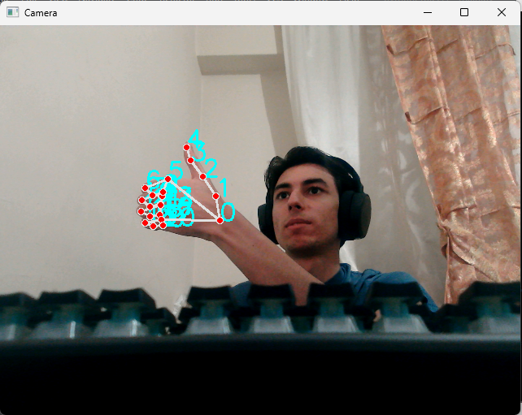

# Python ile kameraya yansıyan renkleri algılayıp karşılaştırma

Projenin amacı başlıkdan da anlaşıldığı gibi renkleri farklı farklı pencerelerde tek renk olarak karşılaştırıp istersek hepsini tek bir pencerede(3 renk bir pencerede) karşılaştırabiliriz.

Ekstra olarak projede el ifadesi tanımlanıp bu ifade uygulandığında programı kapatabilen bir özellik eklenmiştir.

## Öncelikle kulladığımız kütüphaneleri tanıtalım:

-[cvzone](https://pypi.org/project/cvzone/)
-[Mediapipe](https://pypi.org/project/mediapipe/)
-[pyttsx3](https://pypi.org/project/pyttsx3/)
-[numpy](https://pypi.org/project/numpy/)

## Nasıl Çalıştırıcaz

Kütüphaneleri ve kodumuzu indirdikten sonra çalıştırdığımızda tek bir pencere açılıcaktır. Diğer özelliklerimizi açmak için elimizi "👍" yapıyoruz. 2 > 5'ten olucak şekilde(yukarda ki örnek resimde gibi).

## Mantık

